# Amazon Egypt FBA — Business Flow Summary

**Audience:** business owner, operations manager, warehouse manager and accountant  
**Odoo connector reviewed:** `sdlc_amazon_connector` 19.0.10.5.0
**Review basis:** current code and safe local/mocked validation; no live Amazon transaction was performed.

## 1. The Business Cycle

```mermaid
flowchart LR
    WH[Customer Warehouse] -->|Physical dispatch| TR[Amazon FBA Transit]
    TR -->|Amazon receives| FBA[Amazon FBA Inventory]
    FBA -->|Amazon fulfills| SALE[Amazon Sale]
    SALE --> CHG[Returns, fees and adjustments]
    CHG --> SET[Amazon Settlement]
    SET --> ACC[Odoo Accounting]
    ACC --> CLR[Amazon Clearing]
    CLR -->|Actual bank deposit| BANK[Bank]
    BANK --> ZERO[Amazon Clearing = 0]
```



Amazon physically stores and fulfills FBA stock. Odoo remains the operational ERP: it records customer-warehouse stock, controlled dispatch, Amazon receiving evidence, Amazon-side inventory dispositions, orders and financial evidence. Amazon is the source of truth for Amazon-side sellable, reserved and unsellable quantities. The bank transaction—not the Amazon settlement date—is proof that cash was received.

## 2. Who Does What

### What Amazon does

- Accepts the approved inbound plan and returns packing, placement and transportation choices.
- May split one plan into multiple physical shipments and fulfillment centers.
- Receives the dispatched goods and reports cumulative received quantities.
- Stores and classifies FBA stock as sellable, reserved or unsellable.
- Fulfills customer orders and reports returns, removals, inventory events, reimbursements and settlements.
- Transfers the settlement payout separately from the settlement calculation.

### What Odoo currently does automatically

- Polls pending inbound operations every **1 minute**.
- Polls dispatched shipments for Amazon receiving every **30 minutes**.
- Enqueues FBA inventory audits daily and processes them every **5 minutes**.
- Processes order-status reads every **15 minutes** after orders exist.
- Processes trusted FBA sale-stock deltas every **1 minute** after order-item fulfillment evidence is imported.
- Processes returns/removals/reimbursements/settlement report jobs every **5 minutes** after a user or enabled enqueuer creates them.
- Matches reimbursement evidence daily.
- Runs connector health, retry, stuck-job and alert workers at their configured intervals.

Several business enqueuers are intentionally disabled in the reviewed database. Orders, returns, removals, reimbursements and settlements must not be described as fully unattended until the client approves cut-over dates and an implementer enables and validates the dedicated read crons.

### What the client must do

- Approve product/SKU mappings and verify every FBA item is stockable.
- Choose packing, placement and transportation options.
- Pack cartons, print/apply the required product and box labels, and enter tracking for seller-arranged transport.
- Physically count and explicitly dispatch each shipment. Planning alone never moves stock.
- Review inventory differences before approving any Amazon-side stock transfer.
- Physically receive removal shipments back into the customer warehouse.
- Review failed jobs, settlement differences and alerts.

### What the accountant must do

- Approve the accounting strategy, taxes and all account mappings.
- Review the settlement calculation and its supporting lines.
- Create/review the draft journal entry and post it only after approval.
- Match the actual bank deposit to the payout and reconcile Amazon Clearing.
- Investigate partial, over, under or currency-mismatched payouts; the connector does not silently write them off.

## 3. Product and Stock Ownership

For the example product:

| Field | Value | Business owner/source |
|---|---:|---|
| Product | IONIC Dashboard Protectant | Odoo product master after mapping |
| Seller SKU | `24-BHT6-LWJ7` | Exact Amazon/Odoo link key |
| ASIN / FNSKU | From Amazon listing/report evidence | Amazon |
| Odoo Internal Reference | Normally the seller SKU | Odoo |
| Cost | 100 EGP per unit | Odoo |
| Selling price | 180 EGP per unit | Approved business policy/Amazon listing |
| Customer WH/Stock | Physical count in the client warehouse | Odoo/client |
| FBA disposition | Sellable, reserved, unsellable | Amazon |

Product sync can read Amazon listings and link by exact SKU. Missing products can be created as stockable products. Pull Price is an Amazon read and Push Price is an Amazon write. FBA stock is not exported to Amazon: Export Stock is intended for merchant-fulfilled inventory only.

## 4. Sending 30 Units to Amazon

Start with **WH/Stock = 100** and all Amazon locations at zero.

The operator prepares a local inbound record, then supervises these Amazon decisions:

1. Create inbound plan.
2. Generate/list packing options and submit carton information when required.
3. Confirm packing.
4. Generate/list and confirm placement.
5. Review the physical shipment records Amazon returns.
6. Generate/list transportation and delivery-window choices when required.
7. Confirm transportation.
8. Download/store box labels, confirm product labels are applied, and enter tracking when required.
9. Physically count and press **Dispatch** for each physical shipment.

All steps before Dispatch leave **WH/Stock = 100**. Dispatch is the only step that creates and validates the standard Odoo stock movement:

```text
WH/Stock                     100 -> 70
Amazon FBA Transit             0 -> 30
Total owned stock                    100
```

The connector prevents a repeated dispatch from creating a second validated picking.

### If Amazon splits the plan

For a 30-unit plan, Amazon may return:

| Physical shipment | Quantity | Operational treatment |
|---|---:|---|
| Shipment A | 20 | Its own destination, transport, labels, tracking and capped dispatch picking |
| Shipment B | 10 | Its own destination, transport, labels, tracking and capped dispatch picking |
| **Total** | **30** | Never 40 or 60 |

The two records are separate. Neither may dispatch more than its Amazon-assigned quantity.

## 5. Amazon Receiving

Amazon reports cumulative—not incremental—receipts. Odoo stores both Amazon's cumulative value and the quantity it has already processed.

| Amazon cumulative report | Odoo delta | Transit after sync | Received/Staging after sync |
|---:|---:|---:|---:|
| 10 | 10 | 20 | 10 |
| 25 | 15 | 5 | 25 |
| 30 | 5 | 0 | 30 |

Repeated polling therefore cannot receive 10 + 25 + 30. It receives exactly 10 + 15 + 5 = 30.

## 6. Amazon Inventory Disposition

Assume Amazon reports:

```text
Sellable       24
Reserved        4
Unsellable      2
Total          30
```

Odoo does **not** blindly overwrite stock quantities. It creates a complete, paginated inventory audit and differences. An authorized user reviews and approves standard stock transfers from Received/Staging to the Amazon disposition locations. In the current design, one audit line applies one bucket transfer, so allocating all three buckets may require successive complete audits/approvals.

Amazon remains the source of truth for these Amazon-side dispositions; Odoo records a controlled audit trail.

## 7. Amazon Sale — Authoritative Stock Event

If Amazon sells five units at 180 EGP:

```text
Gross sale = 5 x 180 = 900 EGP
```

The connector imports the Amazon order and item-level cumulative fulfilled quantity and can create a linked draft Odoo quotation. One durable stock event owns the physical result. It moves only the newly fulfilled quantity from **Amazon FBA Sellable** to **Amazon FBA Sold / Customers** with standard Odoo stock records:

```text
WH/Stock                 70 -> 70
Amazon FBA Sellable      24 -> 19
Amazon FBA Sold/Customers 0 -> 5
Client-owned total      100 -> 95
```

If Amazon first reports 2 fulfilled and later 5, Odoo moves 2 and then 3—not 2 and then 5. Repeated imports and status checks create no second movement. The ordinary Odoo AFN sale delivery is suppressed and defensively blocked, so it cannot deduct WH/Stock or duplicate the event.

Inventory snapshots remain a control and reconciliation mechanism. They never automatically consume a sale. If a snapshot reaches 19 before the order event runs, the difference is marked as sale overlap and cannot be approved as a competing outbound adjustment. The event then performs the single sale movement; a refreshed audit matches 19 to 19.

### FBA sale stock cutover

When production starts with an opening FBA Sellable balance, old Amazon fulfilled orders before that opening baseline are already included in the count. They must not consume the same Sellable stock again.

Each Amazon instance has an explicit **FBA Sale Stock Cutover** timestamp. The connector uses the imported Amazon order Purchase Date only:

```text
Purchase Date before cutover       = historical; no Sellable depletion
Purchase Date equal/after cutover  = live; normal Sellable -> Sold movement
```

If the cutover is missing, the connector keeps the previous live-processing behavior. It does not silently make every imported order historical. Configure the cutover before importing or status-syncing historical fulfilled orders for an opening-stock rollout.

For the current Amazon Egypt production incident, the intended cutover is `2026-09-05 14:51:51`. The 46 old events totaling 47 units should be repaired manually after review, not automatically during upgrade.

The module upgrade adds the field and event state only. It does not fill the cutover from sync dates and does not auto-repair production data.

Repair creates a standard Odoo picking from **Amazon FBA Sold / Customers** back to **Amazon FBA Sellable** for only the completed stock movement owned by each historical sale-stock event. It does not write stock quants directly, does not touch WH/Stock, Reserved, Unsellable, accounting or Amazon, and a rerun creates no duplicate restoration.

## 8. Customer Return

Assume one 180 EGP item is returned. Odoo imports Amazon's FBA customer-return report and records the reason and disposition evidence. This report does not add one unit to WH/Stock and does not automatically create a credit note.

If Amazon grades the item SELLABLE, Amazon's next complete inventory evidence may increase Sellable. If it is UNSellable, the unsellable bucket changes. Unknown dispositions require review. A customer return to Amazon is not a physical return to the client's warehouse.

## 9. Removal Back to the Customer Warehouse

Assume the client asks Amazon to return three units.

- The removal request is a manual Amazon write.
- Amazon's reports provide the removal order, physical shipment and tracking evidence.
- When Amazon ships, an authorized Odoo user moves the reported delta into **Amazon FBA Removal Transit**. WH/Stock does not change.
- Odoo creates a receipt from Removal Transit to WH/Stock, but the warehouse validates it only after physically counting the goods.

```text
Amazon ships:       Removal Transit +3; WH unchanged
Warehouse receives: Removal Transit -3; WH +3
```

A delivered tracking status alone never increases WH/Stock.

## 10. Disposal, Lost, Damaged and Found

The connector imports Amazon inventory-ledger adjustment evidence. The reviewed configuration is **informational**, so these events create audit evidence but do not automatically move stock.

| Event | Business meaning | Optional controlled stock policy |
|---|---|---|
| Disposal | Amazon destroyed inventory | Unsellable to inventory loss |
| Lost | Amazon cannot locate inventory | Sellable to inventory loss |
| Damaged | Inventory became unsellable | Sellable to Unsellable |
| Found | Amazon recovered a specifically linked prior loss | Reverse that unique loss |

An inventory event is not automatically a financial reimbursement. Amazon may find the goods, reimburse later, reverse a reimbursement, or make no cash reimbursement.

## 11. Reimbursement

If Amazon lost two units and later reports a 200 EGP reimbursement, Odoo imports the reimbursement ID, reason, cash quantity, inventory quantity, amount and any original/reversal relationship. Repeated import is idempotent.

Importing the report does not add stock, create revenue or post a journal entry. The 200 EGP is financially recognized only through a matched settlement line with an approved reimbursement account mapping.

## 12. Settlement, Accounting and Clearing

Use one settlement throughout the example:

| Component | EGP |
|---|---:|
| Gross sales | +900 |
| Refund | -180 |
| Amazon fees | -120 |
| FBA fees | -70 |
| Reimbursement | +200 |
| Other adjustment | -30 |
| **Expected net** | **+700** |

The connector imports Amazon's V2 settlement flat-file report, categorizes the lines and compares the signed calculated net with Amazon's reported net.

```text
Calculated net = 700 EGP
Reported net   = 700 EGP
Difference     =   0 EGP
State          = MATCHED
```

Any non-zero difference, unknown category, missing account or ambiguous order/invoice link blocks accounting creation. The connector creates a **draft** entry only; it does not post automatically.

For a settlement-based strategy, the reviewed code produces this balanced architecture:

| Debit | EGP | Credit | EGP |
|---|---:|---|---:|
| Amazon Clearing | 700 | Sales Revenue | 900 |
| Refund account | 180 | Reimbursement income | 200 |
| Amazon fees expense | 120 | | |
| FBA fees expense | 70 | | |
| Adjustment account | 30 | | |
| **Total** | **1,100** | **Total** | **1,100** |

The recommended first production method is **settlement-based accounting**: the matched Amazon settlement owns sales, refunds, fees, reimbursements and adjustments. The connector retains the Amazon order evidence, but its current sales-order/invoice builder does not reproduce every shipping and gift-wrap tax component as a complete, traceable invoice. Therefore invoice-aware accounting is not approved for the first Egypt go-live. Ambiguous or missing invoice links block that option; the connector never guesses or records sales revenue twice.

If settlement-based accounting is selected and an imported sale/refund is already
linked to a posted customer invoice or credit note, Odoo blocks the settlement
entry rather than booking the amount again. Keep Amazon sales-order invoicing and
posting off for the settlement-based period.

After the settlement entry is posted, Amazon Clearing shows the **700 EGP Amazon owes the client**. Bank remains unchanged.

When Amazon actually deposits 700 EGP, the accountant uses trusted Odoo bank evidence or an explicit receipt reference:

```text
Dr Bank                 700
Cr Amazon Clearing      700
```

After review, posting and reconciliation:

```text
Amazon Clearing = 0
```

There is no automatic Amazon payout/bank-feed import in the connector. Partial, over, under and currency-mismatched payments remain visible for investigation; there is no silent write-off.

## 13. One Numeric Inventory Trace

The table deliberately distinguishes the expected business position from current Odoo capability after an Amazon sale.

| Stage | WH | Transit | Staging | Sellable | Reserved | Unsellable | Removal Transit | Business total | Current Odoo note |
|---|---:|---:|---:|---:|---:|---:|---:|---:|---|
| Start | 100 | 0 | 0 | 0 | 0 | 0 | 0 | 100 | Supported |
| Dispatch 30 | 70 | 30 | 0 | 0 | 0 | 0 | 0 | 100 | Supported |
| Receive 30 | 70 | 0 | 30 | 0 | 0 | 0 | 0 | 100 | Supported |
| Disposition | 70 | 0 | 0 | 24 | 4 | 2 | 0 | 100 | Supported through reviewed approvals |
| Sell 5 | 70 | 0 | 0 | 19 | 4 | 2 | 0 | 95 | Event consumes five from Sellable exactly once; WH unchanged |
| Return 1 as sellable | 70 | 0 | 0 | 20 | 4 | 2 | 0 | 96 | Return report itself creates no move |
| Amazon ships removal 3 | 70 | 0 | 0 | 17 | 4 | 2 | 3 | 96 | Controlled move uses current post-sale Sellable availability |
| Client receives removal | 73 | 0 | 0 | 17 | 4 | 2 | 0 | 96 | Manual physical receipt supported |

Lost, damaged and found events then adjust the business total only where custody truly changes: lost reduces owned stock, damaged only changes disposition, and found reverses a linked loss. With the reviewed informational policy, Odoo records the evidence but stock waits for controlled reconciliation.

## 14. What Must Be Configured Before Go-Live

- Amazon production seller, Egypt marketplace, credentials and required roles.
- One active production instance, ship-from address and correct company.
- Customer warehouse, FBA warehouse and every transit/disposition location.
- Exact SKU mappings, stockable AFN products, UoM, costs and tax policy.
- FBA Sale Stock Cutover, order and settlement cut-off dates; partner/customer and warehouse strategy.
- Approved read-cron activation and intervals; alert recipients and retry ownership.
- Settlement-based accounting selected for the first go-live; a documented accounting cut-off so legacy settlements are not booked twice.
- Accountant-approved mappings for clearing, sales, refunds, Amazon fees, FBA fees, reimbursements, adjustments, promotions, shipping, taxes and other categories.
- Accounting journal, bank journal, company/currency policy and user access rights.
- Named warehouse, Amazon operations and accounting approvers.

## 15. Operational Rhythm

### Daily

- Operations checks failed/retrying jobs, alerts, inbound exceptions and receiving differences.
- Warehouse checks pending labels/tracking, dispatch counts and unvalidated removal receipts.
- No one retries an uncertain Amazon write blindly.

### Weekly

- Review inventory audits/differences, returns, removals and reimbursement matching.
- Review health checks, credentials approaching expiry and terminal failures.

### Each settlement cycle

- Accountant reviews settlement lines and confirms difference = 0.
- Review raw Amazon evidence, category mappings and the draft journal entry; post only after approval.
- Match the actual bank deposit, investigate any variance and reconcile Clearing.
- Confirm the settlement residual is zero; then confirm Amazon Clearing is zero after payout.

## 16. Readiness and Next Step

**READY FOR CONTROLLED LIVE PILOT:** the previously approved, supervised inbound pilot remains ready. It must use a small, physically controlled shipment and the Phase 1 stop-and-verify checklist.

**NOT READY FOR FULL GO-LIVE:** the sale-stock blocker and the settlement-based accounting engine are locally accepted, but the client accountant must still approve the legal tax treatment, production mappings, accounting cut-off and user approvals before financial production operation.

The exact next step is a backed-up staging accounting workshop. Configure settlement-based accounting, the accounting cut-off and all account/bank mappings; then validate the 700 EGP example through a reviewed draft journal entry and clearing reconciliation before production activation. Do not use invoice-aware accounting until its tax evidence gap is separately resolved and accepted.

For the opening FBA stock incident, use this production repair sequence after deploying the fixed code:

1. Upgrade `sdlc_amazon_connector` so the cutover field exists.
2. Configure `fba_sale_stock_cutover_at`.
3. Verify the cutover value.
4. Run dry-run historical repair.
5. Review expected result: 46 events and 47 quantity.
6. Run repair once.
7. Verify Sellable for SKU `24-BHT6-LWJ7` returns from 71 to 118, assuming no valid live event occurred after cutover.
8. Run fresh FBA Inventory Audit.
9. Continue opening stock baseline for remaining mapped products.
10. Only post-cutover Amazon fulfilled events may consume Sellable.

## 17. Safety Record

This documentation phase performed no live Amazon write, created no real inbound plan, dispatched no real stock, posted no real accounting entry and reconciled no real payout.
