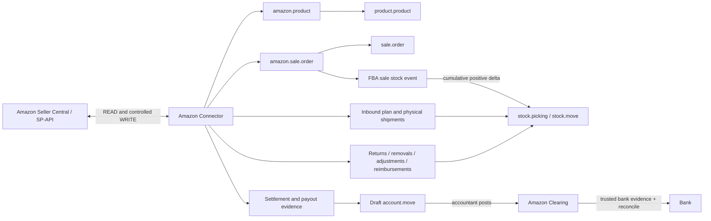

# Amazon Egypt FBA Connector — Implementer Handoff

**Module:** `sdlc_amazon_connector`  
**Version reviewed:** `19.0.10.4.0`
**Database:** `amazon_manual_test`  
**Odoo:** 19 Community  
**Marketplace:** Amazon Egypt (`ARBP9OOSHTCHU`, EU SP-API region)  
**Review date:** 2026-08-31 (Africa/Cairo)
**Safety boundary:** source review and mocked/local validation only. No live Amazon write, physical dispatch, accounting posting, or payout reconciliation was performed.

This document describes current code, not intended architecture. Status words have precise meanings:

- **IMPLEMENTED** — executable current code exists.
- **CONFIGURABLE** — implemented but depends on instance/account/location settings.
- **MANUAL** — a named user decision or standard Odoo validation is required.
- **AUTOMATIC** — an active cron currently enqueues or processes it without a button.
- **NOT IMPLEMENTED** — the requested business result has no safe current code path.
- **OPTIONAL** — available but not required for this FBA scenario.
- **CLIENT PROCESS DEPENDENCY** — a physical, commercial, tax, or treasury decision remains outside the connector.

## 1. Executive Overview

The inbound subsystem remains suitable for a controlled, supervised pilot. It supports the Fulfillment Inbound `v2024-03-20` plan, packing, placement and transportation workflow, preserved label/receiving reads, physical-shipment splitting, explicit dispatch, cumulative receiving deltas, and reviewed FBA inventory reconciliation.

The FBA sale-stock blocker is closed. For each Amazon-fulfilled order item, Orders API `fulfillment.quantityFulfilled` is stored as cumulative Amazon evidence. One durable `amazon.fba.sale.stock.event` moves only the positive unprocessed delta from Amazon FBA Sellable to Amazon FBA Sold / Customers with standard Odoo pickings. Generic AFN sale-order procurement is suppressed and its accidental delivery validation is blocked, so WH/Stock is never the sale source and no second delivery can consume stock.

Full go-live is still not approved. Financial configuration remains a separate gate: the client accountant must select and validate the accounting strategy and tax policy, populate the category accounts, Amazon Clearing and bank journal, and accept the complete order/settlement behavior before unattended production operation.

Confirmed Phase 1 improvements are present: all 16 mapped AFN products in the test database are stockable, durable label attachments and product-label gates are implemented, self-ship delivery-window gating is enforced, and packing-information resubmission is idempotent.

## 2. Architecture



Durable workers persist jobs/cursors/operation IDs in PostgreSQL. Business confirmations and physical validations stay outside unattended schedulers.

## 3. Source-of-Truth Matrix

| Data | Source of truth | Connector treatment |
|---|---|---|
| Seller SKU and Amazon listing identity | Amazon listing, governed by client SKU policy | `amazon.product` is unique by instance + SKU and links to Odoo |
| ASIN | Amazon catalog | Stored on `amazon.product` and evidence rows |
| FNSKU | Amazon FBA evidence | Stored on inventory/return/removal/event rows; not a master field on `amazon.product` |
| Odoo product/internal reference | Odoo | SKU links to `product.product.default_code`; duplicates block automatic linking |
| Customer warehouse stock | Odoo + physical warehouse count | Only standard Odoo stock operations may change it |
| FBA receipt and disposition | Amazon | Read as cumulative receipt/snapshot; Odoo applies guarded deltas/reviewed transfers |
| Order status | Amazon Orders API | Raw status mirrored; local workflow changes only when configured |
| FBA sale depletion | Amazon Orders API item-level cumulative `quantityFulfilled` | Durable event consumes only the unprocessed delta from FBA Sellable; inventory snapshots are reconciliation evidence, not competing sale events |
| Sale price policy | Client decision | Both pull and push exist; recommend Odoo master and controlled push |
| Refund/fee/reimbursement/settlement amount | Amazon V2 settlement report | Signed lines retained and reconciled to reported payout |
| Bank receipt | Odoo bank transaction or explicit bank evidence | Amazon deposit date is not receipt proof |

## 4. Master Automation Matrix

Legend: `R` Amazon read, `W` Amazon write, `S` Odoo stock write, `A` Odoo accounting write. Recommendation classes: **A** automatic in production, **B** manual business decision, **C** automatic only after client approval, **D** never automatic.

| Process | Trigger / button | Cron/job and frequency | R | W | S | A | Current mode/state | Production recommendation |
|---|---|---|:---:|:---:|:---:|:---:|---|---|
| Test Connection | Test Connection | Health cron 15m; each instance due by configured 60m | Y | N | N | N | Manual diagnostic + automatic health, active | A health; B button |
| Sync Products | Sync Products | Dedicated 6h cron disabled; master disabled | Y | N | N | N | Manual; may create/link local products | C daily after onboarding policy |
| Product Setup | Setup wizard | None | N | N | N | N | Manual | B |
| Link by SKU | Link Existing | None | N | N | N | N | Manual; duplicates skipped | B |
| Create Missing Products | Create Missing | None | N | N | N | N | Manual; creates stockable products | B |
| Pull Price | Pull Prices | 6h cron exists but intentionally does no pull | Y | N | N | N | Manual only | B |
| Push Price | Push Prices | 4h cron disabled; master disabled | N | Y | N | N | Manual | C; keep cron off until formal approval |
| Pull Stock | Pull Stock / Run Audit | Daily enqueue + 5m worker active | Y | N | N | N | Audit automatic; no blind overwrite | A daily initially |
| Export Stock | Export Stock | 2h cron disabled | N | Y | N | N | MFN only; AFN skipped | D for FBA-only client |
| Import Orders | Import Orders | 30m enqueuer disabled; 1m worker active | Y | N | N | N | Manual enqueue, automatic processing | A 15m after cut-over approval |
| Incremental Orders | Same | Durable cursor/overlap job | Y | N | N | N | Implemented | A |
| Order Status Sync | Sync Status | 15m cron active | Y | N | Config-dependent | Config-dependent | Automatic read; all workflow flags currently false | A read; C workflow effects |
| FBA sale stock event | Orders import/status item evidence | 1m event worker active | N | N | Y | N | Automatic for mapped stockable AFN lines with positive cumulative shipped quantity | A; monitor manual-review events |
| Cancellation Check | Check Canceled | 2h legacy cron disabled | Y | N | Config-dependent | N | Covered by status sync | A via status sync; keep legacy off |
| Create Inbound Plan | Create Shipment Plan | Poller starts after operation ID | N | Y | N | N | Manual | B |
| Inbound operation polling | Indirect | 1m active worker | Y | N | N | N | Automatic when job exists | A |
| Generate Packing Options | Generate | Same poller | Y | Y | N | N | Manual write, automatic poll | B |
| List Packing Options | Refresh/list | Same worker when queued | Y | N | N | N | Manual enqueue / automatic job | A after enqueue |
| Confirm Packing | Confirm | Same poller | Y | Y | N | N | Manual | B |
| Set Packing Information | Submit Boxes | Same poller | Y | Y | N | N | Manual physical facts | B |
| Generate Placement | Generate | Same poller | Y | Y | N | N | Manual | B |
| List Placement | Refresh/list | Same worker when queued | Y | N | N | N | Manual enqueue / automatic job | A after enqueue |
| Confirm Placement | Confirm | Same poller | Y | Y | N | N | Manual cost/destination decision | B |
| Physical shipments | Created after placement success | Inbound worker | Y | N | N | N | Automatic upsert, exact quantity validation | A |
| Generate Transportation | Generate | Inbound worker polls | Y | Y | N | N | Manual write | B |
| List Transportation | List/refresh | Inbound worker | Y | N | N | N | Automatic after generation | A |
| Delivery windows | Generate/select/confirm | Inbound worker polls | Y | Y | N | N | Manual when required | B |
| Confirm Transportation | Confirm | Inbound worker polls | Y | Y | N | N | Manual commercial decision | B |
| Product labels | External print + Confirm Applied | None | Optional external | N | N | N | Manual client process | B |
| Box labels | Get/View Box Labels | None | Y | N | N | N | Manual retrieval; attachment reused | B before dispatch |
| Submit Tracking | Submit Tracking | Inbound worker polls | Y | Y | N | N | Manual for self-ship | B |
| Create Dispatch Picking | Create Picking | None | N | N | N | N | Manual; reservation only | B |
| Dispatch | Validate picking | None | N | N | Y | N | Explicit physical event | D unattended |
| Receiving enqueue | Optional button / eligibility | 30m cron active | N | N | N | N | Automatic | A 30m |
| Receiving processing | Job | 1m inbound worker active | Y | N | Y | N | Automatic positive delta | A |
| Inventory snapshot/audit | Run Audit or daily enqueue | Daily + 5m worker active | Y | N | N | N | Automatic read/comparison | A |
| Inventory Difference | Audit result | Same job | N | N | N | N | Automatic evidence | A |
| Adjustment review | Mark Reviewed | None | N | N | N | N | Manual | B |
| Apply reconciliation | Apply | None | N | N | Y | N | Manual reviewed standard picking | B |
| Customer Returns | Import button | Daily enqueuer disabled; 5m worker active | Y | N | N | N | Manual enqueue | A daily after approval |
| Removal order submission | Submit | 5m Phase 7 worker | Y | Y | N | N | Manual write + automatic poll | B |
| Removal order/shipment import | Refresh/import | 4h enqueuer disabled; 5m worker active | Y | N | N | N | Manual enqueue | A 4h after approval |
| Removal tracking | Included in shipment report | Same | Y | N | N | N | Imported | A |
| Move Removal to Transit | Shipment button | None | N | N | Y | N | Manual reviewed, auto-validates exact delta | B |
| Removal receipt creation | Create Receipt | None | N | N | Draft picking only | N | Manual | B |
| Removal physical receipt | Validate picking | None | N | N | Y | N | Manual count | D unattended |
| Disposal evidence | Removal detail | Removal job | Y | N | N | N | Audit-only | A import; B stock decision |
| Lost/damaged/found adjustments | Import Adjustments | Daily enqueuer disabled; 5m worker active | Y | N | Policy-dependent | N | Policy `informational` in audited config | A import; C event moves |
| Reimbursement import | Import | Daily enqueuer disabled; 5m worker active | Y | N | N | N | Manual enqueue | A daily after approval |
| Reimbursement matching | Match | Daily enqueuer active + 5m worker | N | N | N | N | Automatic links only | A |
| Settlement import | Import Settlements | Daily enqueuer disabled; 5m worker active | Y | N | N | N | Manual enqueue | A daily after cut-over approval |
| Settlement lines/reconciliation | Import completion / Reconcile | Phase 7 job | N | N | N | N | Automatic compare | A |
| Create Accounting Entry | Create Accounting Entry | None | N | N | N | Y | Manual; draft only | B |
| Accounting posting | Standard Post | None | N | N | N | Y | Manual accountant | D unattended |
| Register payout | Register Payout | No Amazon/bank import cron | N | N | N | Local evidence | Manual | B |
| Create draft bank receipt | Create Draft Receipt | None | N | N | N | Y | Manual; remains draft | B |
| Confirm existing bank transaction | Select/confirm | None | N | N | N | Links posted move | Manual | B |
| Reconcile Clearing | Reconcile | None | N | N | N | Y | Manual standard reconciliation | B |
| Sync Logs | Every API/job action | Cleanup daily | N | N | N | N | Automatic | A |
| Jobs / Retry Center | Worker failures | Retry dispatcher 5m | Depends | Never blind replay | Guarded | N | Automatic only when classified safe | A |
| Alerts | Local evidence | 15m operational evaluator active | N | N | N | N | Automatic | A |
| Health Check | Instance/dashboard | 15m cron active | Y | N | N | N | Automatic | A |

## 5. Cron and Job Matrix

All XML IDs are prefixed `sdlc_amazon_connector.`. “Active” is the module/database state reviewed after the Phase 1 upgrade.

| XML ID | Name | Model → method | Interval | Active | Selection/purpose | API | Safe / recommendation |
|---|---|---|---:|:---:|---|---|---|
| `cron_amazon_import_orders` | Import All Orders | `amazon.instance.cron_import_orders()` | 30m | No | All instances; enqueue order jobs | R | Enable only after cut-over; harden inactive-instance scope |
| `cron_amazon_process_order_import_jobs` | Process Order Import Jobs | `amazon.order.import.job.cron_process_order_import_jobs()` | 1m | Yes | One due draft/running job | R | Safe worker |
| `cron_amazon_sync_order_statuses` | Sync Order Statuses | `amazon.order.status.sync.job.cron_sync_order_statuses()` | 15m | Yes | Due enabled instance/job | R | Safe read; workflow flags separately controlled |
| `cron_amazon_process_fba_sale_stock_events` | Process FBA Sale Stock Events | `amazon.fba.sale.stock.event.cron_process_fba_sale_stock_events()` | 1m | Yes | Due pending AFN item events; positive cumulative delta only | None / S | Safe event worker; insufficient stock stops for review |
| `cron_amazon_sync_products` | Sync Products | `amazon.instance.cron_sync_products()` | 6h | No | All instances, synchronous report | R | Recommend daily after product policy |
| `cron_amazon_update_prices` | Update Product Prices | `amazon.instance.cron_update_prices()` | 4h | No | All instances | W | Keep off until explicit approval |
| `cron_amazon_import_settlement` | Import Settlement Reports | `amazon.instance.cron_import_settlement_reports()` | 1d | No | Active instances; enqueue Phase 7 job | R | Enable after settlement cut-over |
| `cron_amazon_check_canceled` | Check Canceled Orders | `amazon.instance.cron_check_canceled_orders()` | 2h | No | Legacy status alias | R | Leave off; status cron covers it |
| `cron_amazon_import_fbm_orders` | Import FBM Orders | `amazon.instance.cron_import_fbm_orders()` | 15m | No | All instances | R | FBA scenario: off |
| `cron_amazon_export_stock` | Export Stock Levels | `amazon.instance.cron_export_stock()` | 2h | No | MFN products only | W | FBA scenario: off |
| `cron_amazon_update_fbm_status` | Update FBM Status | `amazon.instance.cron_update_fbm_order_status()` | 1h | No | FBM only | R/W | FBA scenario: off |
| `cron_amazon_process_inbound_operation_jobs` | Poll Inbound Operations | `amazon.inbound.operation.job.cron_process_inbound_operation_jobs()` | 1m | Yes | One due pending/in-progress job | R | Safe durable poller |
| `cron_amazon_sync_inbound_receiving` | Synchronize Inbound Receiving | `amazon.fba.physical.shipment.cron_enqueue_receiving_sync()` | 30m | Yes | Up to 50 dispatched, non-terminal shipments | R/S via worker | Safe with delta guards |
| `cron_amazon_import_removal` | Refresh Removal Status | `amazon.instance.cron_refresh_fba_removal_status()` | 4h | No | Active instances; order + shipment reports | R | Recommend 4h after approval |
| `cron_amazon_pull_stock` | Enqueue Audits Compatibility | `amazon.instance.cron_pull_stock()` | 4h | No | Alias to audit enqueuer | R | Keep off to avoid duplicate schedule |
| `cron_amazon_enqueue_inventory_audits` | Enqueue Daily Inventory Audits | `amazon.inventory.reconciliation.run.cron_enqueue_inventory_audits()` | 1d | Yes | Active instances, enabled, no active run | None | Safe enqueuer |
| `cron_amazon_process_inventory_audits` | Process Inventory Audits | same model `cron_process_inventory_audits()` | 5m | Yes | One due queued run | R | Safe complete-snapshot worker |
| `cron_amazon_pull_prices` | Pull Prices | `amazon.instance.cron_pull_prices()` | 6h | No | Logs manual-only warning; no pull | None | Leave off |
| `cron_amazon_full_sync` | Full Bidirectional Sync | `amazon.instance.cron_full_sync()` | 1h | No | Mixed product/order/price/stock actions | R/W | Never enable for this FBA rollout |
| `cron_amazon_master_scheduler` | Master Auto-Sync | `amazon.instance.cron_master_scheduler()` | 15m | No | Instances with `auto_sync_enabled` | R/W | Keep off; mixes reads and writes |
| `cron_amazon_smart_alerts` | Smart Alert Scan | `amazon.smart.alert.run_alert_scan()` | 4h | No | Local product/sync signals | None | Optional after data is trustworthy |
| `cron_amazon_health_scores` | Product Health Scores | `amazon.product.health.calculate_all_health_scores()` | 1d | No | All instances | Optional AI/local | Optional |
| `cron_amazon_connection_health` | Check Connection Health | `amazon.instance.cron_run_health_checks()` | 15m | Yes | Active, monitoring enabled, due by instance interval | R | Safe |
| `cron_amazon_refresh_operations_dashboard` | Refresh Operations Dashboard | `amazon.operations.dashboard.cron_refresh_operations_dashboard()` | 15m | Yes | Local aggregates | None | Safe |
| `cron_amazon_detect_stuck_jobs` | Detect Stuck Jobs | `amazon.operation.control.cron_detect_stuck_jobs()` | 10m | Yes | Stale active job records | None | Safe; does not replay unknown writes |
| `cron_amazon_dispatch_operational_retries` | Dispatch Eligible Retries | `amazon.operation.control.cron_dispatch_operational_retries()` | 5m | Yes | Due retry-safe controls | Depends | Safe classification required |
| `cron_amazon_operational_alerts` | Evaluate Operational Alerts | `amazon.smart.alert.cron_evaluate_operational_alerts()` | 15m | Yes | Local health/jobs/differences | None | Safe |
| `cron_amazon_cleanup_operational_records` | Clean Successful Logs | `amazon.operation.control.cron_cleanup_operational_records()` | 1d | Yes | Retention thresholds | None | Safe; preserve failures/audit evidence |
| `cron_amazon_process_phase7_jobs` | Process Removal Orders and FBA Events | `amazon.phase7.job.cron_process_jobs()` | 5m | Yes | Up to 10 due Phase 7 jobs | R or controlled W | Safe worker; removal submission only after manual enqueue |
| `cron_amazon_import_fba_customer_returns` | Import Customer Returns | `amazon.instance.cron_import_fba_customer_returns()` | 1d | No | Active instances, overlapping report window | R | Recommend daily after approval |
| `cron_amazon_import_fba_inventory_adjustments` | Import Inventory Adjustments | `amazon.instance.cron_import_fba_inventory_adjustments()` | 1d | No | Active instances | R | Recommend daily, informational policy |
| `cron_amazon_import_fba_reimbursements` | Import Reimbursements | `amazon.instance.cron_import_fba_reimbursements()` | 1d | No | Active instances | R | Recommend daily after approval |
| `cron_amazon_match_fba_reimbursements` | Match Reimbursements | `amazon.instance.cron_match_fba_reimbursements()` | 1d | Yes | Active instances; local matching job | None | Safe |

### Background job behavior

| Job model | States | Attempts / schedule | Locking and duplicate protection | Terminal/manual recovery |
|---|---|---|---|---|
| `amazon.order.import.job` | draft, running, done, partial, failed | Durable `next_token`, `next_run_at`; 429 uses `Retry-After` + jitter; date-bound correction max 3 | `FOR UPDATE SKIP LOCKED LIMIT 1`; one active job per instance | Failed/partial visible in Jobs/Retry Center; requeue same source safely |
| `amazon.order.status.sync.job` | draft, pending, running, done, partial, failed | `retry_count`, `next_run_at`; 429 deferral and safe date bounds | Row `SKIP LOCKED`; one active job per instance | Permanent conflicts create review/activity rather than destructive workflow |
| `amazon.fba.sale.stock.event` | pending, processing, done, manual_review, failed | max 5; persisted attempts and exponential local retry capped at 60m | Unique instance+order+item; row `FOR UPDATE`; instance/product advisory lock; cron `SKIP LOCKED`; cumulative minus processed delta | Unmapped SKU, decreased evidence or insufficient Sellable requires review; retry is visible through Jobs/Retry Center/Alerts |
| `amazon.inbound.operation.job` | pending, in_progress, done, failed | max 12; 1/2/4/8/15-minute capped poll backoff | Row `SKIP LOCKED`; unique operation type + operation ID; shipment locks | Stored operation ID is resumable; unknown write outcome is manual review, never blind replay |
| `amazon.inventory.reconciliation.run` | queued, running, completed, failed | max 5; exponential delay capped 60m; `Retry-After` can extend | Job row lock plus transaction advisory lock per instance; one active run | Incomplete snapshot never becomes an adjustment basis; explicit retry |
| `amazon.phase7.job` | pending, running, waiting_amazon, done, failed | max 12; 429/5xx/timeout retries; `Retry-After` or exponential capped 60m | `SKIP LOCKED`; active operation dedupe by instance/type and by source for writes | Role/configuration/permanent errors fail and alert; manual retry after correction |
| `amazon.operation.control` | running/waiting/failed/resolved/manual-review states | overlay `attempt_count`, `retry_count`, `next_retry_at`, instance max (default 5), base 60s | Links one source record; dispatcher checks source row lock and retry safety | Manager retry/admin retry/manual review; write-unknown is not auto-retried |

All durable job state survives server restart because identifiers, cursors, attempts and next-run dates are stored in PostgreSQL.

## 6. Product Flow

```text
Amazon listing
   ↓ Sync Products [AMAZON READ]
amazon.product (instance + seller SKU)
   ↓ exact SKU/default_code mapping [LOCAL]
product.product
```

- SKU is the seller listing identifier and the connector’s direct key. It should equal Odoo Internal Reference.
- ASIN is Amazon’s catalog identity.
- FNSKU is the FBA label identity. Current code keeps it on inventory/event evidence rather than `amazon.product`.
- `Sync Products` imports the Merchant Listings report, upserts `amazon.product`, links one exact Odoo SKU match, and creates a missing stockable Odoo product when no match exists.
- `Product Setup`, `Link by SKU`, and `Create Missing Products` are local/manual.
- `Pull Price` is `[AMAZON READ]` and also overwrites the linked Odoo list price. Keep manual unless Amazon is deliberately selected as price master.
- `Push Price` is `[AMAZON WRITE]` through a JSON Listings feed. It reports feed submission, not final feed-result acceptance; keep automatic price push disabled.
- `Pull Stock` is an alias for the supported FBA Inventory audit, not a quantity overwrite.
- `Export Stock` is `[AMAZON WRITE]` for MFN only; AFN listings are skipped.

Recommended ownership: Amazon is master for Amazon identity and FBA disposition; Odoo is master for WH stock, cost, UoM and approved selling price.

## 7. Warehouse Architecture

| Location | Type | Meaning / custody / source | In | Out | Mode and picking |
|---|---|---|---|---|---|
| WH/Stock | internal | Client physical warehouse; Odoo/client count is truth | Purchases, returns/removal receipts | Explicit FBA dispatch and other Odoo deliveries | Standard Odoo operations; physical validation manual |
| Amazon FBA Transit | transit | Client-owned stock handed to carrier, not yet received by Amazon | FBA dispatch picking | Receiving positive delta | Dispatch manual; receiving automatic standard pickings |
| Amazon FBA Received / Staging | internal under FBA warehouse Stock | Amazon physically received; disposition not yet assigned | Receiving delta | Reviewed disposition transfers | Automatic receipt, manual reconciliation |
| Amazon FBA Sellable | internal under FBA warehouse Stock | Amazon says fulfillable | Reviewed reconciliation/SELLABLE return evidence | FBA sale events, disposition and removal actions | Sale event automatic; other transfers reviewed standard pickings |
| Amazon FBA Reserved | internal under FBA warehouse Stock | Amazon reserved for orders/transfers/processing | Reviewed reconciliation | Reviewed redistribution | Manual reviewed picking |
| Amazon FBA Unsellable | internal under FBA warehouse Stock | Amazon holds but cannot sell | Reviewed reconciliation/damage | Reviewed redistribution/removal | Manual reviewed picking |
| Amazon FBA Sold / Customers | customer | Units Amazon has fulfilled to its customer and which have left client ownership | Idempotent FBA sale-stock delta | None; returns re-enter only from later Amazon disposition evidence | Automatic standard outgoing picking; never WH/Stock |
| Amazon FBA Customer Returns | customer | Legacy virtual evidence location | Current return importer does not move stock here | None in current return path | Compatibility only |
| Amazon FBA Removal Transit | transit | Amazon shipped back; client has not counted receipt | Reviewed removal dispatch | Manual customer receipt | Dispatch move auto-validates after manager review; receipt is manually validated |
| Amazon FBA Disposal / Inventory Loss | inventory | Ownership loss/scrap evidence | Optional trusted lost/destroyed event moves | Found reversal | Default policy informational; event moves require approval |

The connector creates/repairs these locations with stable instance-role markers. Received/Sellable/Reserved/Unsellable must be children of the configured FBA warehouse Stock hierarchy; transit, customer-return, removal-transit and disposal must be outside it.

## 8. FBA Inbound

For SKU `24-BHT6-LWJ7`, starting WH/Stock 100 and shipment 30:

1. Draft, plan, packing, box information, placement, transportation, labels and tracking do not move on-hand stock. WH/Stock remains 100.
2. Placement may create Shipment A 20 and Shipment B 10 as separate `amazon.fba.physical.shipment` records.
3. Each shipment has separate FC, item lines, transportation selection, labels, tracking and dispatch picking.
4. **Create Dispatch Picking** creates standard `stock.picking`/`stock.move`, source configured `fba_source_location_id`, destination Transit, and reserves exact assigned quantities. Reservation does not change on-hand.
5. Physical handover followed by standard picking validation moves WH/Stock 100 → 70 and Transit 0 → 30.
6. Unique active picking checks, row locks, exact line caps and done-state checks prevent duplicate dispatch.

All irreversible Amazon selections and physical validations remain manual. The one-minute worker only polls an operation already created by a manual action.

## 9. Receiving

`cron_amazon_sync_inbound_receiving` enqueues eligible dispatched physical shipments every 30 minutes. `amazon.inbound.operation.job` processes receiving work every minute.

Each physical line stores `amazon_received_quantity` (latest Amazon cumulative value) and `processed_received_quantity` (already moved by Odoo). Movement is:

```text
delta = Amazon cumulative received - processed received
```

| Sync | Amazon cumulative | Delta moved | Transit | Received/Staging |
|---:|---:|---:|---:|---:|
| Start | 0 | 0 | 30 | 0 |
| 1 | 10 | 10 | 20 | 10 |
| 2 | 25 | 15 | 5 | 25 |
| 3 | 30 | 5 | 0 | 30 |

Shipment/line locks, processed quantities, linked picking checks and dispatched caps prevent duplicate or excess receipts. Decreases, overages, unknown SKUs and mismatches create discrepancies rather than stock.

## 10. Inventory Reconciliation

The FBA Inventory API snapshot is paginated and duplicate seller-SKU rows are aggregated. Sellable, Reserved, Unsellable, inbound working, inbound shipped and inbound receiving are stored separately. A snapshot must be complete before review.

For Amazon 24 Sellable, 4 Reserved and 2 Unsellable, Odoo does **not** automatically redistribute the 30 staging units. It creates one audit line and a critical/manual-review difference. A manager chooses one supported transfer, records evidence, marks it reviewed, then applies a standard picking. Because a line allows one applied transfer, allocating all three buckets requires successive complete audits/transfers, for example 24 staging→sellable, next audit 4 staging→reserved, next audit 2 staging→unsellable.

Supported reviewed reconciliation transfers remain among Received/Sellable/Reserved/Unsellable. Sale consumption is owned exclusively by the order-item event, never by an audit action. Audit lines expose `pending_sale_event_qty` and an overlap state. A snapshot net outflow or a difference explained by an unprocessed sale event is blocked from adjustment; after the event picking, the line is refreshed and becomes matched when Amazon and Odoo both show 19. There is no blind quantity overwrite or direct `stock.quant` write.

## 11. Orders

The durable Orders job upserts `amazon.sale.order` by instance + Amazon order ID, imports order items, resolves each item by SKU, and automatically creates a linked **draft** `sale.order` when all mappings exist.

Current behavior:

- Partner: search/create by shipping name; this requires client review because identical names can merge customers.
- Warehouse: AFN uses configured FBA warehouse; MFN uses FBM warehouse.
- Product: linked `product.product`; any missing mapping skips SO creation and logs the order.
- Currency: Amazon order currency is applied.
- Price: SO line uses imported item price divided by quantity.
- Taxes: Amazon item/shipping tax evidence is stored on Amazon lines, but the SO builder does not explicitly reproduce Amazon tax components.
- Shipping, gift wrap and promotion: stored on Amazon lines but not created as separate SO lines by this builder.
- Confirmation: draft by default; configurable flags can confirm on Amazon statuses.
- Delivery: Orders API item fulfillment quantities are synchronized to the durable FBA sale event. AFN lines do not launch generic sale procurement, and any accidental generic AFN picking is blocked from validation.
- Invoice: optional creation on Shipped; posting is separately configurable and off by default.

### FBA stock effect — implemented authoritative owner

For an AFN item, `(instance, Amazon order ID, Amazon order item ID)` identifies one stock event. `quantityFulfilled` is cumulative: if Amazon first reports 2 and later 5, the standard Sellable→Sold/Customers pickings are 2 and 3. The processed quantity advances in the same transaction as successful picking validation. Re-importing or re-syncing 5 produces zero delta. Zero fulfillment, cancellation before fulfillment and financial refunds create no stock move. Missing mappings, decreasing cumulative evidence and insufficient Sellable stock stop in manual review rather than using WH/Stock or allowing negative stock.

The linked draft quotation remains commercial evidence. It cannot create a competing AFN delivery: procurement is suppressed for its AFN lines and stock validation has a defensive event-link guard.

## 12. Returns

Source: `GET_FBA_FULFILLMENT_CUSTOMER_RETURNS_DATA` through a durable Reports job. Import is currently manual because its daily enqueuer is disabled.

Rows retain order, SKU/ASIN/FNSKU, quantity, reason, FC, status, comments and detailed disposition. A deterministic hash prevents duplicate rows where the report provides no event ID. `SELLABLE` maps to sellable; damaged/defective/expired values map to unsellable; unknown values require review.

Return import creates neither stock movements nor credit notes. A one-unit customer return does not mean WH/Stock +1. Amazon keeps custody and its next inventory snapshot is the stock authority. Refund money is recognized through a linked settlement refund or an approved credit-note strategy.

## 13. Removals

- A removal request submission is an Amazon feed write and remains manual. The Phase 7 worker polls the feed and checks the processing document; `DONE` alone is not treated as row acceptance.
- Order detail and shipment detail reports are reads. They store cumulative shipped/disposed quantities, carrier and tracking with stable compound identities.
- Import is audit-only. A manager may explicitly **Move to Removal Transit** when the disposition identifies Sellable/Unsellable and source stock is sufficient. Only the unprocessed cumulative delta moves.
- Amazon tracking or Delivered status never increases WH/Stock.
- **Create Receipt** creates an unvalidated picking from Removal Transit to configured WH/Stock. The warehouse counts actual units and validates it; partial/backorder behavior uses standard Odoo controls.

For three units: shipment review moves FBA source −3 and Removal Transit +3; physical receipt moves Removal Transit −3 and WH/Stock +3. Duplicate shipment/receipt links and cumulative quantities prevent a second move.

## 14. Disposal, Lost, Damaged and Found

Source: `GET_LEDGER_DETAIL_VIEW_DATA` with `eventType=Adjustments`.

| Event | Current default effect (`adjustment_stock_policy=informational`) | Optional approved `event_moves` effect | Financial effect |
|---|---|---|---|
| Disposal/destroyed | Evidence/audit only | Unsellable → Disposal/Loss | None from event; settlement may later contain charge/reimbursement |
| Lost | Evidence/audit only | Sellable → Disposal/Loss | None from event |
| Damaged | Evidence/audit only | Sellable → Unsellable | None from event |
| Found | Evidence/audit only | Reverse one uniquely linked prior loss | None from event |

Unknown reasons and ambiguous found reversals require review. Inventory evidence is not reimbursement evidence: stock ownership changes and Amazon compensation are separate facts and may occur on different dates.

## 15. Reimbursements

Source: `GET_FBA_REIMBURSEMENTS_DATA`. The importer stores reimbursement ID, item line key, reason, SKU/FNSKU/ASIN, cash quantity, inventory quantity, exact reported total quantity, amount per unit, signed total, currency, original reimbursement ID/type, and matching links.

Instance + reimbursement/item line identity makes overlap imports idempotent. Reversal rows resolve to a unique original where possible; ambiguity remains manual. Matching can link a return, adjustment, removal, order, original/reversal and later settlement line.

Importing a 2-unit, 200 EGP reimbursement does not add stock and does not create income or a journal entry. The 200 EGP becomes financially recognized only when the V2 settlement includes a +200 reimbursement component and an accountant creates/posts the reviewed settlement entry.

## 16. Settlements

Current source is Amazon’s automatically generated `GET_V2_SETTLEMENT_REPORT_DATA_FLAT_FILE_V2`, discovered with Reports API `getReports`; the connector does not create settlement reports and does not use Finances as a second ledger.

Signed rows are classified as sale, refund, Amazon fee, FBA fee, reimbursement, promotion, adjustment, shipping, tax, other credit/debit, or unknown. Stable line keys upsert overlap imports. Unknown categories, parse errors, missing order links for sales/refunds and currency inconsistencies block accounting.

Example:

| Component | EGP |
|---|---:|
| Gross sales | +900 |
| Refund | -180 |
| Amazon fees | -120 |
| FBA fees | -70 |
| Reimbursement | +200 |
| Other adjustment | -30 |
| **Calculated net** | **+700** |

`900 - 180 - 120 - 70 + 200 - 30 = 700`. If Amazon reported net is 700, difference is 0 and reconciliation becomes `matched`. Any non-zero currency-rounded difference remains `mismatch`; accounting entry creation is blocked until evidence is corrected rather than forced.

## 17. Accounting

### Required mappings

| Mapping | Purpose / normal type | Required when | Missing behavior |
|---|---|---|---|
| Settlement Journal | Draft settlement move; General journal | Every settlement entry | Blocks entry |
| Amazon Clearing | Amazon receivable/clearing; non-bank current asset | Every settlement/payout | Blocks entry |
| Sales Revenue | Settlement-based sales | Sale without posted invoice | Blocks line |
| Refund Account | Settlement-based refund/contra revenue | Refund without posted credit note | Blocks line |
| Amazon Fees | Marketplace commissions; expense | Amazon-fee line | Blocks line |
| FBA Fees | Fulfillment/storage expense | FBA-fee line | Blocks line |
| Reimbursement | Other income/recovery | Reimbursement line | Blocks line |
| Adjustment | Expense/income policy account | Adjustment line | Blocks line |
| Promotion | Promotion/discount | Promotion line without posted customer document | Blocks line |
| Shipping | Shipping revenue/expense policy | Shipping line without posted invoice | Blocks line |
| Tax | Tax settlement clearing account approved by accountant | Tax line without posted invoice | Blocks line |
| Other Credit / Debit | Reviewed residual categories | Classified other row | Blocks line |
| Suspense | Reserved future review only | Not used to bypass unknown categories | Unknown remains blocked |
| Payout Bank Journal | Bank and default cash account | Manual draft receipt | Blocks receipt |

The implementer proposes account types; the Egyptian accountant approves chart, VAT and recognition policy.

### Settlement-based 700 EGP entry

`Create Accounting Entry` is `[ODOO ACCOUNTING WRITE]` and creates a draft only:

| Account | Debit | Credit |
|---|---:|---:|
| Amazon Clearing | 700 | 0 |
| Refund Account | 180 | 0 |
| Amazon Fees Expense | 120 | 0 |
| FBA Fees Expense | 70 | 0 |
| Adjustment Account | 30 | 0 |
| Sales Revenue | 0 | 900 |
| Reimbursement Income/Recovery | 0 | 200 |
| **Total** | **1,100** | **1,100** |

### Invoice-aware hybrid

If the +900 sale links safely to a posted customer invoice, settlement credits that invoice’s receivable instead of Sales Revenue. If the -180 refund links safely to a posted credit note, settlement debits receivable instead of the Refund Account. Fees, reimbursements and adjustments still use their mappings. This clears customer receivable against Amazon Clearing without booking the same revenue/refund twice.

Draft or ambiguous documents, missing order links, unknown categories and a reimbursement already marked financially posted block the move. One settlement can create only one move. The connector never calls `action_post()` for the settlement; accountant review and posting are manual.

Because the current SO builder does not exactly reproduce all Amazon tax/shipping/promotion components, invoice-based production accounting requires a separate controlled validation before selection. Settlement-based accounting is implemented, but its tax treatment still requires accountant approval.

## 18. Amazon Clearing

Amazon Clearing is the amount Amazon owes the seller after sales, refunds, fees and adjustments. Posting the example settlement debits Amazon Clearing 700; Bank is unchanged. The Amazon deposit date is scheduling/report metadata, not proof that the bank received cash.

```text
After settlement posting:
Amazon Clearing debit balance = 700 EGP
Bank movement = 0
```

## 19. Bank Payout

There is no Amazon payout-import or bank-feed cron in this module. Two manual evidence paths are implemented:

1. Link an existing posted Odoo bank statement transaction whose counterpart is exactly Amazon Clearing.
2. Enter an actual bank receipt reference and create a draft bank-journal move:

```text
Dr Bank                 700
Cr Amazon Clearing      700
```

An accountant posts the receipt, then **Reconcile Clearing** uses standard Odoo reconciliation. Exact linked lines, instance, company and currency are validated; cross-currency is blocked. Partial receipts leave residual clearing, over/underpayments remain mismatch, and no automatic write-off is created.

After exact payout reconciliation, Amazon Clearing is 0.

## 20. Numeric End-to-End Example

Product: IONIC Dashboard Protectant, SKU `24-BHT6-LWJ7`, cost 100 EGP, Amazon price 180 EGP.

### Inventory trace: business truth versus current Odoo result

Assume the return is graded Sellable; later events are lost 2, damaged 1 and found 1 reversing one lost unit.

| Stage | Business/Amazon custody | Total owned | Current Odoo tracked result | Explanation |
|---|---|---:|---|---|
| Start | WH 100 | 100 | WH 100 | Odoo/client truth |
| Dispatch 30 | WH 70, Transit 30 | 100 | Same | Implemented exact pickings |
| Receive 30 | WH 70, Staging 30 | 100 | Same | Implemented deltas 10/15/5 |
| Disposition | WH 70, Sellable 24, Reserved 4, Unsellable 2 | 100 | Same after successive reviewed audits | No blind auto-transfer |
| Sale 5 | WH 70, Sellable 19, Reserved 4, Unsellable 2, Sold/Customers 5 | 95 | Same owned balance; event picking is Sellable 24→19 and WH stays 70 | Implemented cumulative delta, exactly once |
| Return 1 sellable | WH 70, Sellable 20, Reserved 4, Unsellable 2 | 96 | Return report itself moves nothing; reviewed complete snapshot may restore Sellable to 20 | Return disposition, not refund, owns re-entry |
| Removal ships 3 | WH 70, Sellable 17, Reserved 4, Unsellable 2, Removal Transit 3 | 96 | Same after reviewed removal move | Uses current post-sale/post-return availability |
| Removal received | WH 73, Sellable 17, Reserved 4, Unsellable 2 | 96 | Same after warehouse validates physical receipt | Standard receipt |
| Lost 2 | WH 73, Sellable 15, Reserved 4, Unsellable 2 | 94 | Default informational policy leaves 17/4/2 until controlled reconciliation | Evidence awaits audit/policy |
| Damaged 1 | WH 73, Sellable 14, Reserved 4, Unsellable 3 | 94 | Default informational policy remains unchanged until reconciliation | Reclassification, not ownership loss |
| Found 1 | WH 73, Sellable 15, Reserved 4, Unsellable 3 | 95 | Default informational policy remains unchanged until reconciliation | Reversal requires unique prior loss |

The sale difference is now closed by the authoritative event. Lost/found timing differences remain intentional under the current informational event policy until a reviewed stock policy or reconciliation is applied.

### Financial trace

| Event | Recognized through reviewed settlement | Amazon Clearing effect |
|---|---:|---:|
| Sale | +900 revenue | +900 |
| Refund | -180 | -180 |
| Amazon fees | -120 expense | -120 |
| FBA fees | -70 expense | -70 |
| Reimbursement | +200 income/recovery | +200 |
| Adjustment | -30 | -30 |
| **Settlement net** | **700** | **700 debit balance** |
| Actual bank payout | Bank +700 | Clearing -700 |
| **Final** |  | **Clearing 0** |

## 21. Implementer Configuration

### Amazon

- One active production instance only; correct seller ID, Egypt marketplace and EU region.
- LWA refresh token/client credentials and required roles: Orders, Amazon Fulfillment/Pricing reports, Finance and Accounting settlement reports, Listings only if price writes are approved.
- Verify production versus sandbox credentials without copying test identifiers.

### Warehouse

- Company, client WH/Stock source, dedicated FBA warehouse, ship-from contact and removal-return contact.
- Transit, Received/Staging, Sellable, Reserved, Unsellable, **Sold / Customers**, Customer Returns, Removal Transit and Disposal/Loss location markers.
- Internal operation type and opening-stock migration policy.

### Products

- Unique SKU/Internal Reference, AFN classification, stockable status, UoM, cost and tax defaults.
- Resolve all unmapped/FNSKU-only evidence before automation.

### Orders

- Initial import start/end and overlap; start with one day and batch 10.
- Review partner strategy; current by-name behavior may not be acceptable.
- Verify the one-minute FBA sale event worker and Sold / Customers location. Keep generic AFN delivery automation off; the connector rejects it independently.
- Keep SO auto-confirm, invoice creation and posting off until order/accounting acceptance tests pass.

### Accounting

- Select settlement-based or invoice-aware strategy.
- Configure and accountant-approve all category accounts, general journal, Amazon Clearing, bank journal/default bank account, VAT and cut-over date.
- Ensure no earlier settlement or invoice period will be imported twice.

### Automation and security

- Keep master/full sync and all Amazon write crons disabled.
- Stagger read/report enqueuers to respect usage plans.
- Assign Amazon User, Amazon Manager, Technical Administrator, Stock Manager and Accounting roles with segregation of duties. Settlement/payout actions require both accounting access and Amazon Manager.

## 22. Client Responsibilities

- Approve packing, placement, transportation and any charge-bearing Amazon decision.
- Measure boxes, apply product/box labels and provide carrier/tracking facts.
- Validate dispatch only after physical handover.
- Review and approve inventory differences with Amazon evidence.
- Count and validate removal receipts.
- Decide product/price/partner/tax/accounting policies.
- Review settlement mismatch and draft moves; post only after approval.
- Provide actual bank evidence and reconcile payout without silent write-off.

## 23. Daily / Weekly / Monthly Runbook

### Daily

- Operations Dashboard: connection health, failed/waiting/stuck jobs and throttling.
- Check new orders/status conflicts, inbound operations, receiving discrepancies and critical inventory differences.
- Check FBA Sale Stock Events for unmapped items, insufficient Sellable stock or exhausted retries.
- When enabled, check return/removal/adjustment/reimbursement/settlement import jobs.
- Never duplicate-click an Amazon write with unknown outcome.

### Weekly

- Review Retry Center terminal failures, unresolved alerts, unmapped SKUs/FNSKUs and stale receiving.
- Review returns without order/item match, removals awaiting receipt, unmatched reimbursements and ignored inventory differences.
- Confirm cron intervals and Amazon request rates remain appropriate.

### Settlement cycle / monthly

- Confirm all V2 reports are present and each reported net equals calculated net.
- Resolve unknown categories/order links/reimbursement links.
- Review draft settlement entry, tax and category accounts; post with accountant approval.
- Match actual bank receipt, post receipt if connector-created, reconcile Clearing, and investigate every residual.

## 24. Monitoring

- **Operations Control Center:** first overview for health, failures, inbound blocks and inventory mismatches.
- **Jobs:** durable business-job state, cursor, attempts and next run.
- **FBA Sale Stock Events:** order/item/SKU, cumulative and processed quantities, last delta, picking, attempts and error evidence.
- **Retry Center:** error classification, retry safety and manual/admin retry.
- **Sync Logs:** endpoint, method, HTTP status, Amazon request ID, rate-limit and sanitized request/response evidence.
- **Alerts:** operational, mapping, unknown disposition, settlement and reimbursement issues.
- **Health Check:** token refresh plus read-only marketplace participation call.
- **Inventory Audits/Differences:** complete snapshot, bucket evidence and reviewed transfers.
- **Settlement/Payout:** line classification, net difference, clearing line and bank allocation.

## 25. Troubleshooting

| Problem | First screen | Check | Safe action | Never do |
|---|---|---|---|---|
| Orders stopped | Jobs / Sync Logs | Enqueuer active, safe date window, mapping, 429 | Wait for Retry-After or retry same job | Create overlapping jobs repeatedly |
| FBA sale event blocked | FBA Sale Stock Events / Retry Center | item mapping, cumulative vs processed, Sellable availability, linked picking | Reconcile evidence/stock, then use controlled retry | Use WH/Stock, edit processed quantity, or validate a generic AFN delivery |
| HTTP 429 | Retry Center | Retry-After, operation metrics | Let persisted deferral run | Hammer Sync buttons |
| Auth failure | Health Check | token, roles, marketplace | Correct credentials/role then retry read | Replace credentials blindly |
| Inbound/packing/placement/transport stuck | Inbound Jobs | stored operation ID, Amazon status, unknown outcome | Poll/reconcile existing operation | Reissue unknown write |
| Receiving stopped | Physical shipment / Jobs | dispatched cap, confirmation ID, discrepancy | Correct mapping/evidence and resume | Manually edit processed quantity |
| Inventory mismatch | Latest complete Audit | pagination, mapping, bucket differences | Record reason and reviewed transfer | Write quants or assume omitted SKU is zero |
| Return missing | Phase 7 Jobs | date window, report role, event key | Requeue same interval | Add WH stock from return row |
| Removal missing | Removal / Phase 7 Jobs | both reports, tracking, disposition | Refresh same job | Create receipt from tracking alone |
| Reimbursement missing | Phase 7 Jobs | report role/date/line identity | Requeue safe read | Book income from expected cost |
| Settlement missing | Phase 7 Jobs | Finance role, V2 report, cut-over | Queue discovery | Create settlement manually without report |
| Settlement mismatch | Settlement lines | parse errors, signs, unknown categories | Correct classification/source evidence | Force `matched` or write off |
| Accounting blocked | Settlement Accounting | match state, mappings, order/invoice links | Configure/review | Post suspense blindly |
| Payout mismatch | Payout | exact bank amount/currency/allocation | Leave partial/mismatch visible | Silent write-off |
| Clearing not zero | Settlement/Payout + GL | posted clearing lines and residuals | Reconcile exact linked lines/investigate | Edit residual fields directly |

## 26. Go-Live Checklist

- [ ] Production database backup
- [ ] Correct Amazon production instance; no duplicate active instance
- [ ] Credentials, Egypt marketplace and Amazon roles verified
- [ ] Module version `19.0.10.4.0` verified
- [ ] Product mappings unique; all AFN products stockable; UoM/cost/tax reviewed
- [ ] Warehouse/FBA structure, source WH/Stock and ship-from verified
- [ ] Opening-stock policy agreed and loaded once
- [ ] Order start date and settlement start date agreed
- [ ] Partner strategy and order batch/overlap agreed
- [ ] Read crons enabled/staggered; write crons remain disabled
- [ ] Retry limits, alerts, health and retention configured
- [ ] Accounting strategy selected and accountant-approved
- [ ] Journal, clearing, sales, refund, fee, FBA fee, reimbursement, adjustment, tax and other accounts mapped
- [ ] Bank journal/default bank account and user permissions verified
- [ ] Controlled FBA pilot completed; receiving and disposition verified
- [x] **FBA sale stock-depletion owner implemented and locally accepted (20 mocked scenarios)**
- [ ] Live order, return/removal and reimbursement evidence verified where available
- [ ] Settlement net matched; draft entry reviewed and posted
- [ ] Actual payout evidence reconciled; Amazon Clearing = 0

## 27. Acceptance Criteria

| Area | Measurable acceptance |
|---|---|
| Products | One instance+SKU mapping; no duplicate Odoo Internal Reference; all AFN mapped products stockable |
| Orders | Repeated overlap import creates one Amazon order and one SO; every line maps; start/end bounds auditable |
| FBA sales | Cumulative shipped 2→5 creates deltas 2+3 only; repeat import/status creates zero; WH/Stock unchanged; snapshot overlap cannot apply a second sale deduction |
| FBA inbound | One plan per action; operation IDs persisted; physical shipment quantities sum exactly to plan; no stock movement before dispatch |
| Receiving | For cumulative 10/25/30, moves are 10/15/5; total never exceeds dispatched; repeat poll creates zero |
| Inventory | All pages read; duplicate SKUs aggregated; snapshot complete; no direct quant or blind zero; every applied transfer has reviewer/evidence |
| Returns | Duplicate row hash does not duplicate; no WH increase/credit note from return report; unknown dispositions alert |
| Removals | Cumulative shipment delta moves once; tracking does not receive stock; physical receipt uses standard validation |
| Reimbursements | Instance/reimbursement/item key is idempotent; reversal link visible; import creates no stock/accounting |
| Settlement | Calculated signed net equals reported net and difference is zero; unknown/missing links block |
| Accounting | Draft move balanced; one move per settlement; invoice-linked revenue not duplicated; no automatic posting |
| Payout | Trusted posted bank evidence or explicit receipt reference; exact currency/allocation; no write-off |
| Clearing | Settlement clearing residual reconciles to zero after the actual payout |

## 28. Known Limitations and Remaining Gaps

| Classification | Gap | Required action |
|---|---|---|
| **BLOCKER BEFORE LIVE PILOT** | None for the already-approved supervised inbound pilot | Follow Phase 1 checklist |
| **BLOCKER BEFORE GO-LIVE** | Invoice-based order values do not fully reproduce Amazon tax/shipping/promotion evidence | Validate/fix invoice strategy or select accountant-approved settlement-based strategy |
| **PRODUCTION CONFIGURATION** | Accounting mappings and bank journal require client approval/population | Configure in staging; validate 700 EGP example |
| **PRODUCTION CONFIGURATION** | Initial order/settlement dates and several read enqueuers are disabled | Approve cut-over and enable only recommended dedicated crons |
| **PRODUCTION CONFIGURATION** | Adjustment policy is informational | Keep it or approve/test event moves explicitly |
| **CLIENT PROCESS DEPENDENCY** | Product/FNSKU labels printed externally | Named operator confirms physical application |
| **CLIENT PROCESS DEPENDENCY** | Physical dispatch/removal receipt and accounting posting | Segregated authorized users |
| **PRODUCTION LIMITATION** | Product partner creation searches by name | Agree partner strategy before order go-live |
| **PRODUCTION LIMITATION** | Price/stock feed buttons record submission, not final feed-result acceptance | Keep automatic writes off; add feed-result lifecycle before unattended use |
| **PRODUCTION LIMITATION** | One reconciliation line applies one bucket transfer | Use successive complete audits or enhance controlled multi-transfer workflow |
| **PRODUCTION LIMITATION** | No automatic Amazon/bank payout import; cross-currency payout blocked | Use trusted Odoo bank evidence; manual FX workflow if needed |
| **PRODUCTION LIMITATION** | Ambiguous network outcome after an Amazon write requires manual reconciliation | Never replay blindly |
| **OPTIONAL ENHANCEMENT** | Automated product-label generation/printing and Amazon notifications | Add only after the core production blockers are closed |

### Exact next implementation step

The FBA sale-stock owner is implemented and the mocked acceptance matrix passes. The next gate is a backed-up staging accounting workshop: select settlement-based or invoice-aware accounting, approve Egypt tax treatment and every account/bank mapping, then run the 700 EGP example from imported evidence through a reviewed draft entry and clearing reconciliation. Do not enable unattended order/accounting go-live or post real accounting before that separate acceptance is complete.

## 29. Phase 2.6 — Accounting and Tax Go-Live Gate

### Current, verified accounting architecture

Settlement evidence is imported from the Amazon Reports API settlement report type
`GET_V2_SETTLEMENT_REPORT_DATA_FLAT_FILE_V2`. Discovery accepts only completed
reports; the connector downloads the report document, handles the documented
encoding/compression path, normalizes headers, preserves raw row evidence and
uses deterministic settlement and row identities. A second import reuses the
same settlement and line records. A malformed row remains visible as a parse
error and prevents accounting.

`amazon.settlement.report` owns calculated/reported net, matching and the single
linked `account.move`. `amazon.settlement.report.line` owns classification,
raw Amazon evidence, order/reimbursement links and the final account mapping.
Accounting creation is a manual action. It takes a database row lock, reuses an
existing move, verifies the report is matched and complete, then creates exactly
one **draft** journal entry. It never posts that move. Standard Odoo accounting
permissions govern posting and reconciliation.

The manual payout model (`amazon.payout` and allocations) accepts either exact,
already-posted Odoo bank-statement evidence or an explicit receipt reference.
It never treats the settlement date as a bank receipt, never writes off a
difference, and blocks cross-company/cross-currency or wrong-clearing evidence.

### Strategy and ownership rule

`amazon.instance.settlement_accounting_strategy` is explicit and defaults to
`settlement_based`. The recommended first production strategy is
**settlement-based**. It gives every component one owner: the matched settlement
line. `invoice_aware` is guarded and supported only when each financial sale,
refund, promotion, tax or shipping line has one reliable Amazon-order link and
one posted invoice/credit-note receivable target. It is not certified for the
first Egypt go-live because, although connector order lines retain item price,
item tax, shipping price/tax, gift-wrap price/tax and promotion discount, the
current SO/invoice builder does not reproduce them as complete, separately
traceable invoice evidence.

As an additional hard stop, settlement-based accounting blocks a sale/refund
financial line when its imported evidence is already linked to posted customer
accounting. It does not silently change strategy or credit revenue again. Keep
Amazon SO invoice creation/posting disabled while settlement-based accounting
owns the period.

| Component | Amazon evidence | First-go-live accounting owner | Duplicate protection |
|---|---|---|---|
| Sale, refund, promotion, shipping, tax | V2 settlement line | Matched settlement line | One report move; invoice-aware requires exactly one posted linked document |
| Marketplace/FBA fees | V2 settlement line | Matched settlement line | Deterministic line key and mapped category |
| Reimbursement | Reimbursement report plus settlement line | Matched settlement line, not the reimbursement import | Unique reimbursement identity and existing-financial-owner block |
| Adjustment/other credit/debit | V2 settlement line | Matched settlement line with approved account | Unknown category blocks posting |
| Payout | Actual bank evidence | Standard Odoo bank/cash entry | Exact allocation, currency/company/clearing validation |

Do not switch strategy or accounting cut-off after any settlement accounting
move exists. The instance write guard blocks it; a migration requires a controlled
cut-over, accountant approval and a new financial ownership period.

### Tax-readiness matrix

| Component | Amazon/order evidence retained | Invoice representation | Settlement representation | Status |
|---|---|---|---|---|
| Product sale | Item price | Product SO line | Sale | Configurable |
| Product VAT | Item tax | Not proved as a complete invoice tax mapping | Tax | Accountant decision required |
| Shipping | Shipping price | Not complete as a separate SO/invoice component | Shipping | Settlement-based ready; invoice-aware blocked |
| Shipping VAT | Stored on connector order line | No separate invoice component | Tax if reported | Invoice-aware blocked |
| Gift wrap / gift-wrap VAT | Stored on connector order line | No separate invoice component | If reported, preserved as raw settlement evidence | Invoice-aware blocked |
| Promotion | Promotion discount | Not complete as an invoice component | Promotion | Settlement-based ready with mapping |
| Refund tax / fee tax | Settlement evidence | No certified credit-note mapping | Tax/refund | Accountant decision required |
| Currency | Order/settlement currency | Standard Odoo currency fields | Settlement currency | Same-company/currency validation; cross-currency payout blocked |

The connector supplies evidence and account mapping points. It does not choose an
Egypt VAT rate, legal invoice treatment, tax-inclusive policy, or account code.

### Exact 700 EGP settlement, clearing and payout

For the approved settlement-based example, signed evidence is `+900 -180 -120
-70 +200 -30 = +700 EGP`; calculated net equals reported net, difference is
zero and the state is `matched`. With mapped accounts, the single draft move is:

| Debit | EGP | Credit | EGP |
|---|---:|---|---:|
| Amazon Clearing | 700 | Sales Revenue | 900 |
| Refund account | 180 | Reimbursement account | 200 |
| Amazon Fees expense | 120 | | |
| FBA Fees expense | 70 | | |
| Adjustment account | 30 | | |
| **Total** | **1,100** | **Total** | **1,100** |

After an authorized accountant posts it, Amazon Clearing is debit 700: Amazon
owes the client; bank is unchanged. Only actual 700 EGP bank evidence may then
produce `Dr Bank 700 / Cr Amazon Clearing 700`. Standard Odoo reconciliation
of those exact clearing lines leaves a zero residual. A 690 EGP payout leaves
10 EGP open for investigation; partial/overpayment, wrong currency, wrong
company and duplicate payout evidence are blocked or remain visibly unreconciled.

### Accounting cut-off, configuration and approvals

Set `settlement_accounting_cutoff_date` before any financial entry. A settlement
whose deposit date is before it can be imported as evidence but cannot create
connector accounting; legacy accounting owns that period. On/after the cut-off,
the selected connector strategy owns the period. Required configuration is the
settlement journal, Amazon Clearing, every used category account (sales, refund,
Amazon fee, FBA fee, reimbursement, adjustment, promotion, shipping, tax, other
credit/debit), bank journal/default bank account, compatible company/currency,
and accountant-approved tax treatment. Missing mappings block creation with a
specific error; no arbitrary fallback or suspense account is used.

Creating/reviewing settlement accounting and payout actions requires both Amazon
Manager and Odoo accounting access. Posting remains the normal explicit Odoo
`account.move` action and retains Odoo's accounting controls; the connector does
not sudo around it. Recommended segregation is operations import/review,
accountant draft review, accounting manager posting/reconciliation, and technical
administrator configuration only.

### Monitoring, automation and acceptance

Settlement discovery/import is a read-only background capability but its cron is
currently disabled pending production approval. Accounting creation, posting,
payout evidence and reconciliation are manual. Monitor settlement/report ID,
period, currency, reported/calculated net, difference, parse errors, unknown
categories, unmatched links, draft/posted move, clearing residual and payout
allocation in Settlement/Payout, Jobs, Retry Center, Alerts and Sync Logs.

Acceptance requires: duplicate report/document/row import creates no duplicate
financial record; unknown/malformed/unmapped/mismatched evidence blocks a draft
move; one matched settlement has one balanced draft move; a posted invoice cannot
create duplicate sales revenue in explicit invoice-aware mode; reimbursements are
recognized only once by settlement; a refund never changes FBA or WH stock; and
only an exact, trusted payout can close Clearing. The local mocked Phase 2.6
suite covers these controls, including the existing FBA sale-stock regression.
